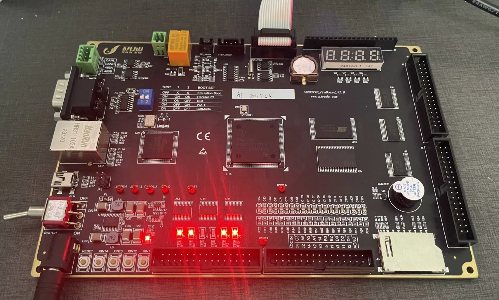

PEBSA : Power electronics basic software architecture.
=============================
TMS320F28377D x uC-OS3 

This is a TI CCS project for TMS320F28377D with uC-OS3. 

The project is configured to use the F28377D CPU1 and CPU2.

The project is continuously optimized to achieve product-level application.

### Dependencies

* TI CCS v20.0.0 or later
* TI F28377D peripheral drivers
* TI C2000Ware driverlib
* uC-OS3 v3.08.02

### Hardware
* 

### TODO List:
- [✓] uC/OS3 transplantation
- [✓] TI register library and driver library coexistence
- [✓] PWM as master interrupt configuration
- [✓] ADC oversamping configuration
- [✓] Relay, digital tube and led configuration 
- [✓] Parameter management
- [✓] FLASH, SRAMM, EEPROM configuration
- [x] SCI com configuration
- [x] SPI com configuration
- [x] I2C com configuration
- [x] CAN com configuration
- [x] Socket configuration
- [x] MCU Shell
- [x] CPU1 and CPU2 coexistence

